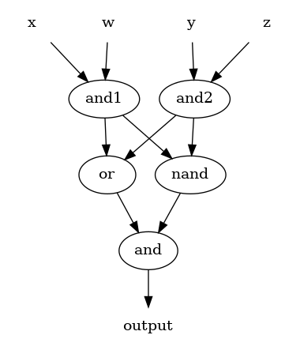
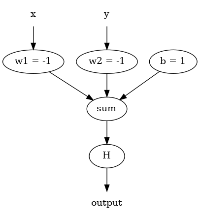
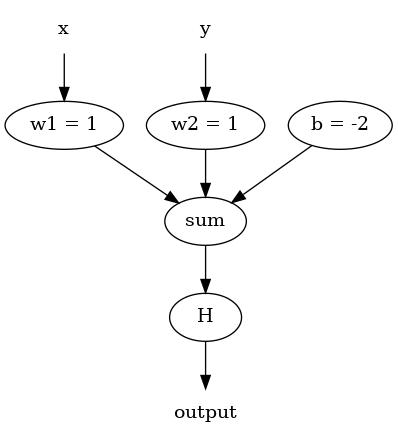
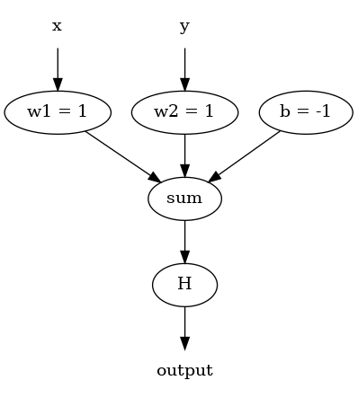
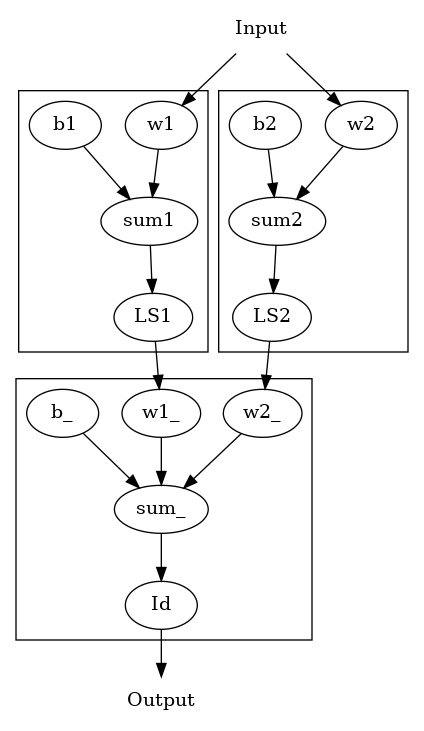

# Neural Networks

## Introduction

- neural networks are biologically inspired
- 86 billion neural networks in the human brain
- regions of the human brain are somewhat specialised

### Applications

**Pattern cognition**:

- early detection of breast cancer
- identifying lame cattle

**Computer vision**:

- separating signals of different origin in sky maps
- recognizing letters and reading signs

**Anomaly detection**:

- network management
- malware analysis and classification

### Biological Neuron

**Main components of a biological neuron**:

- axon
- axon terminal
- dendrite
- myelin sheath
- necleus
- node of ranvier
- schwann cell

### Artificial Neuron

- takes **inputs values** ( x\_1, x\_2, x\_3, \dots x\_n )
  -   input could be anything e.g. sensors on a robot, pixel values or
      vital signs of patient
- feeds them into a **function** that takes a **vector** as input
- combines then into a **single output**

E.g.:

-   every input $x_1, x_2, x_3, \dots x_n$ is multiplied by **weight**
    $W_{1j}, W_{2j}, W_{3j}, \dots W_{nj}$
-   we take the sum of  those products and feed it into some function

$$F(\sum_{i=1}^{n} (x_i W_{ij}))$$

Where $F$ could be e.g. Log-Sigmoid (LS) function.

Multi-layer feed-forward neural networks can be used to approximate any
smooth function to arbitrary precision. I.e. you can take any smooth
function and build a neural network that gets pretty close to it.

That is given:

- enough neurons in the hidden (middle) layer
- 

### Notation

The cumbersome $W_{1j}, W_{2j}, W_{3j}, \dots W_{nj}$ notation can be
replaced with **w** (the sequence of numbers is treated as a vector). A
dot $\cdot$ denotes dot product.

E.g.: $\boldsymbol{w} \cdot \boldsymbol{q}$ is the sum of products of
every nth elements of vector **w** and **q**.

### Activation Functions

#### Log-Sigmoid Activation Function

$$LS(n) = \frac{1}{1 + e^{-n}}$$

#### Heaviside Activation Function

Another common activation function is the Heaviside (H) step function.

$$
   H(n) =
\begin{cases}
1, & \text{if $n$ $\geq$ 0} \\
0, & \text{otherwise}
\end{cases}
$$

**NOTE** the output of H is always either 0 or 1 i.e. discrete and
suitable for yes-or-no decision problems.

## Perceptron

- simplest form of neural networks
- single-layered
- 2 inputs and optionally a bias
- **linear classifier**
- therefore it will never get to the state with all the input vectors
    classified correctly if the training set D is not **linearly
    separable**,
    - i.e. if the positive examples cannot be separated from the
        negative examples by a hyperplane
    - no "approximate" solution will be gradually approached under the
        standard learning algorithm -- **learning will fail**

**NOTE**: addition of vectors occurs element-wise.

### The Perceptron Learning Rule

If $H(\boldsymbol{w} \cdot \boldsymbol{p} + b) = 0$ but you expected $1$

then $\boldsymbol{w} = \boldsymbol{w} + \boldsymbol{p},\ b = b + 1$ else
if $H(\boldsymbol{w} \cdot \boldsymbol{p} + b) = 1$ but you expected $0$

then $\boldsymbol{w} = \boldsymbol{w} - \boldsymbol{p},\ b = b - 1$

### Detecting Dogs

Suppose there is a linear relationship between size and domestication such
that:

``` {.haskell}
domestication size
  | size == 0 = 1
  | size == 95 = 0
```

### Examples

#### Lights in a Row Problem



#### Logical NAND



#### Logical AND 



#### Logical OR



## Mulitlayer Neural Nets

### Steepest Descent

- The task is to find the values of $x$ and $y$ such that $f(x, y) = 0$
- You will need a function of two variables $f(x,\ y) = z$
    - The function will produce a surface
    - values it produces are on the $z$ axis

1. Calculate $f^2$
    - this will prevent you from going *below* $0$
    - in other words, whatever value you'll find will be bounded by $0$ so you no
      longer need to worry about finding a negative value

2. Calculate a partial derivative of $f_2$ with respect to $x$ and a partial derivative with respect to $y$ i.e. $\frac{\partial{f^2}}{\partial{x}}$ and $\frac{\partial{f^2}}{\partial{y}}$
3. Choose a starting point $p_0 = (x_0, y_0)$ on the surface
4. While stability has not been reached, evaluate:
    - To get rate of change, feed values of $x_i$ and $y_i$ into the corresponding partial derivatives i.e. $\frac{\partial{f^2}}{\partial{x}}(x_i, y_i)$
    - Multiply the values by the learning rate $\alpha$
    - Update $x_{i + 1}$ and $y_{i + 1}$ values by decrementing them

$$ 
x_{i + 1} = x - (\Delta x) \alpha \ \ 
y_{i + 1} = y - (\Delta y) \alpha 
$$

<div style="text-align: center">Where:</div>

$$ 
\Delta x = \frac{\partial{f^2}}{\partial{x}}(x_i, y_i)\ \
\Delta y = \frac{\partial{f^2}}{\partial{y}}(x_i, y_i)\ \
\alpha = \frac{1}{10}
$$

### Backpropagation

The primary algorithm for performing gradient descent on neural
networks. First, the output values of each node are calculated (and
cached) in a forward pass. Then, the partial derivative of the error
with respect to each parameter is calculated in a backward pass through
the graph.

- the principle is the same as in the previous example
- the aim is to minimise the loss function $E(t, y) = (t - y)^2$
    (squared error)
- remember that $y$ is itself a function since it's the output of the
    final layer.
- you repeatedly take partial derivatives of the loss function $E$
    with respect to each of the tweakable parameters (e.g. $w_1$, $w_2$,
    $b_1$ $\dots$)
- take steps proportional to the negative of the gradient

**NOTE**: the error function that be run on a **batch** and then we take the average:

$$ E = \frac{\sum_{k=1}^{n} (t_k - y_k)^2}{n} $$

E.g.: in a 1-2-1 network:



$$
N = Id(LS(x w_1 + b_1) {w'}_1 + LS(x w_2 + b_2) {w'}_2 + b')
$$

Which is the same as:
$$
N  = LS(n_1) {w'}_1 + LS(n_2) {w'}_2 + b'
$$

Even shorter:

$$
N  = a_1 {w'}_1 + a_2 {w'}_2 + b' = n'
$$

where:

- $x$ is the (only) input
- $a_1$ is the output of neuron 1 from the first layer
- $Id$ is the identify function
- $LS$ is the $Log-Sigmoid$ activation function
- $w_1$ is the $weight$ in neuron 1
- $b'$ is the bias on the second layer
- $n'$ is the output of the second layer

In effect the derivative of $E$, for instance, with respect to ${w'}_2$ is:

$$
\frac{\partial{Id(LS(x w_1 + b_1) {w'}_1 + LS(x w_2 + b_2) {w'}_2 + b')}}{\partial{{w'}_2}}\ \
$$

To make the computation feasible, the **chain rule** is used to minimise the amount
of calculations performed.

$$
\frac{\partial{f}}{\partial{g}} \frac{\partial{g}}{\partial{x}} = \frac{\partial{f}}{\partial{x}}
$$

We calculate **sensitivities** which are essentially partial derivatives.

- Since $E = (t - a')^2$ then $\frac{\partial{E}}{\partial{a'}} = 2a' - 2t = 2(a' - t)$ (this is $s'$).
- $s_1 = \frac{\partial{E}}{\partial{n_1}}$
- $s_2 = \frac{\partial{E}}{\partial{n_2}}$

## Glossary

Smoothness
:   A smooth function is a function that has derivatives of all orders everywhere in its domain.

Log-Sigmoid

:   - S-shaped
    - produces values between -1 and 1
    - [smooth](#smoothness)

    $$LS(n) = \frac{1}{1 + e^{-n}}$$

Convex Set
:   A set $S$ is convex if for every pair of points ($p_1$, $p_2$) in $S$ the line in
    between $p_1$ and $p_2$ is also in $S$

Multilayer
:   more than 1 layer i.e. has at least 1 hidden layer

Feedforward Neural Network

:   - connections between the nodes do not form cycles or loops
    - information moves in only one direction, forward, from the input
        nodes, through the hidden nodes (if any) and to the output
        nodes.

See <https://www.wikiwand.com/en/Backpropagation>.
